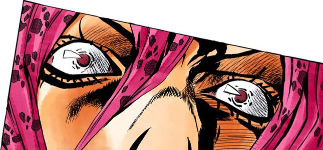

  

  

  

# 💫 About Me:
Hi 👋,  
I'm **Jaurès AGOSSOU**, a final year computer science student with a strong drive to excel in game development and software engineering.  
🔭 I'm currently working on **Rs-Island**, a 2D rogue-like game 
👯 I'm looking to collaborate on 2D/3D games in Unity and from scratch 
🌱 I'm currently learning Backend development 
⚡ Fun fact: I'm an anime/manga lover and a huge gamer — expect a few JoJo references around here 👀 

> *"The wind... it's blowing."* — Diavolo, Vento Aureo

## 🌐 Socials:
    

# 💻 Tech Stack:
                   

## 🎮 <samp>Game Dev</samp>

# 📊 GitHub Stats:
 
 

## 🏆 GitHub Trophies

### ✍️ Random Dev Quote

---

  

